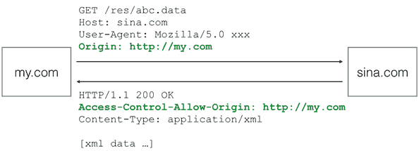

# js note 

## 浏览器

### AJAX

> Asynchronous JavaScript and XML：意思就是用JavaScript执行异步网络请求。
如果你想把标准写法和IE写法混在一起，可以这么写：

 ```js
 var request;
if (window.XMLHttpRequest) {
    request = new XMLHttpRequest();
} else {
    request = new ActiveXObject('Microsoft.XMLHTTP');
}
 ```

 通过检测`window`对象是否有`XMLHttpRequest`属性来确定浏览器是否支持标准的`XMLHttpRequest`。注意，不要根据浏览器的`navigator.userAgent`来检测浏览器是否支持某个`JavaScript`特性，一是因为这个字符串本身可以伪造，二是通过IE版本判断`JavaScript`特性将非常复杂。
 
 当创建了`XMLHttpRequest`对象后，要先设置`onreadystatechange`的回调函数。在回调函数中，通常我们只需通过`readyState === 4`判断请求是否完成，如果已完成，再根据`status === 200`判断是否是一个成功的响应。

`XMLHttpRequest`对象的`open()`方法有3个参数，第一个参数指定是`GET`还是`POST`，第二个参数指定`URL`地址，第三个参数指定是否使用异步，默认是`true`，所以不用写。

注意，千万不要把第三个参数指定为`false`，否则浏览器将停止响应，直到`AJAX`请求完成。如果这个请求耗时10秒，那么10秒内你会发现浏览器处于“假死”状态。

最后调用`send()`方法才真正发送请求。`GET`请求不需要参数，`POST`请求需要把`body`部分以字符串或者`FormData`对象传进去。

#### [安全限制](https://www.liaoxuefeng.com/wiki/001434446689867b27157e896e74d51a89c25cc8b43bdb3000/001434499861493e7c35be5e0864769a2c06afb4754acc6000)

> **默认情况下，JavaScript在发送AJAX请求时，URL的域名必须和当前页面完全一致。**
>>完全一致的意思是，域名要相同（www.example.com和example.com不同），协议要相同（http和https不同），端口号要相同（默认是:80端口，它和:8080就不同）。有的浏览器口子松一点，允许端口不同，大多数浏览器都会严格遵守这个限制。

1. 第三种方式称为JSONP，它有个限制，只能用GET请求，并且要求返回JavaScript。这种方式跨域实际上是利用了浏览器允许跨域引用JavaScript资源
2. JSONP通常以函数调用的形式返回
3. 这样一来，我们如果在页面中先准备好foo()函数，然后给页面动态加一个`<script>`节点，相当于动态读取外域的JavaScript资源，最后就等着接收回调了。
4. 因此我们需要首先在页面中准备好回调函数
5. 最后用getPrice()函数触发：

```html 1
<html>
<head>
    <script src="http://example.com/abc.js"></script>
    ...
</head>
<body>
...
</body>
</html>
```

```js
//2
foo('data');
//3
refreshPrice({"0000001":{"code": "0000001", ... });
//4
function refreshPrice(data) {
    var p = document.getElementById('test-jsonp');
    p.innerHTML = '当前价格：' +
        data['0000001'].name +': ' + 
        data['0000001'].price + '；' +
        data['1399001'].name + ': ' +
        data['1399001'].price;
}
//5
function getPrice() {
    var
        js = document.createElement('script'),
        head = document.getElementsByTagName('head')[0];
    js.src = 'http://api.money.126.net/data/feed/0000001,1399001?callback=refreshPrice';
    head.appendChild(js);
}
```

#### [CORS](https://www.liaoxuefeng.com/wiki/001434446689867b27157e896e74d51a89c25cc8b43bdb3000/001434499861493e7c35be5e0864769a2c06afb4754acc6000)

如果浏览器支持HTML5，那么就可以一劳永逸地使用新的跨域策略：CORS了。

CORS全称Cross-Origin Resource Sharing，是HTML5规范定义的如何跨域访问资源。

Origin表示本域，也就是浏览器当前页面的域。当JavaScript向外域（如sina.com）发起请求后，浏览器收到响应后，首先检查`Access-Control-Allow-Origin`是否包含本域，如果是，则此次跨域请求成功，如果不是，则请求失败，JavaScript将无法获取到响应的任何数据。



假设本域是my.com，外域是sina.com，只要响应头`Access-Control-Allow-Origin`为`http://my.com`，或者是`*`，本次请求就可以成功。

可见，跨域能否成功，取决于对方服务器是否愿意给你设置一个正确的`Access-Control-Allow-Origin`，决定权始终在对方手中。

上面这种跨域请求，称之为“简单请求”。简单请求包括`GET`、`HEAD`和`POST`（POST的`Content-Type`类型
仅限`application/x-www-form-urlencoded、multipart/form-data和text/plain`），并且不能出现任何自定义头（例如，X-Custom: 12345），通常能满足90%的需求。

> 无论你是否需要用JavaScript通过CORS跨域请求资源，你都要了解CORS的原理。最新的浏览器全面支持HTML5。在引用外域资源时，除了JavaScript和CSS外，都要验证CORS。
>>如果该CDN服务商未正确设置Access-Control-Allow-Origin，那么浏览器无法加载字体资源。对于PUT、DELETE以及其他类型如application/json的POST请求，在发送AJAX请求之前，浏览器会先发送一个OPTIONS请求（称为preflighted请求）到这个URL上，询问目标服务器是否接受。
>>
>>服务器必须响应并明确指出允许的Method
>>
>>浏览器确认服务器响应的Access-Control-Allow-Methods头确实包含将要发送的AJAX请求的Method，才会继续发送AJAX，否则，抛出一个错误。由于以POST、PUT方式传送JSON格式的数据在REST中很常见，所以要跨域正确处理POST和PUT请求，服务器端必须正确响应OPTIONS请求。需要深入了解CORS的童鞋请移步[W3C文档](https://www.w3.org/TR/cors/)。

### Promise

在JavaScript的世界中，所有代码都是单线程执行的。

古人云：“君子一诺千金”，这种“承诺将来会执行”的对象在JavaScript中称为Promise对象。

我们先看一个最简单的Promise例子：生成一个0-2之间的随机数，如果小于1，则等待一段时间后返回成功，否则返回失败

```js
function test(resolve, reject) {
    var timeOut = Math.random() * 2;
    log('set timeout to: ' + timeOut + ' seconds.');
    setTimeout(function () {
        if (timeOut < 1) {
            log('call resolve()...');
            resolve('200 OK');
        }
        else {
            log('call reject()...');
            reject('timeout in ' + timeOut + ' seconds.');
        }
    }, timeOut * 1000);
}
```

这个`test()`函数有两个参数，这两个参数都是函数，如果执行成功，我们将调用`resolve('200 OK')`，如果执行失败，我们将调用`reject('timeout in ' + timeOut + ' seconds.')`。可以看出，test()函数只关心自身的逻辑，并不关心具体的`resolve`和`reject`将如何处理结果。

有了执行函数，我们就可以用一个Promise对象来执行它，并在将来某个时刻获得成功或失败的结果:

```js
var p1 = new Promise(test);
var p2 = p1.then(function (result) {
    console.log('成功：' + result);
});
var p3 = p2.catch(function (reason) {
    console.log('失败：' + reason);
});
```

Promise对象可以串联起来，所以上述代码可以简化为：

```js
new Promise(test).then(function (result) {
    console.log('成功：' + result);
}).catch(function (reason) {
    console.log('失败：' + reason);
});
```

实际测试一下，看看Promise是如何异步执行的：

```js
'use strict';

// 清除log:
var logging = document.getElementById('test-promise-log');
while (logging.children.length > 1) {
    logging.removeChild(logging.children[logging.children.length - 1]);
}

// 输出log到页面:
function log(s) {
    var p = document.createElement('p');
    p.innerHTML = s;
    logging.appendChild(p);
}
new Promise(function (resolve, reject) {
    log('start new Promise...');
    var timeOut = Math.random() * 2;
    log('set timeout to: ' + timeOut + ' seconds.');
    setTimeout(function () {
        if (timeOut < 1) {
            log('call resolve()...');
            resolve('200 OK');
        }
        else {
            log('call reject()...');
            reject('timeout in ' + timeOut + ' seconds.');
        }
    }, timeOut * 1000);
}).then(function (r) {
    log('Done: ' + r);
}).catch(function (reason) {
    log('Failed: ' + reason);
});
```

```txt
Log:

start new Promise...

set timeout to: 1.8571884388119746 seconds.

call reject()...

Failed: timeout in 1.8571884388119746 seconds.
```

可见Promise最大的好处是在异步执行的流程中，把执行代码和处理结果的代码清晰地分离了：


Promise还可以做更多的事情，比如，有若干个异步任务，需要先做任务1，如果成功后再做任务2，任何任务失败则不再继续并执行错误处理函数。

要串行执行这样的异步任务，不用Promise需要写一层一层的嵌套代码。有了Promise，我们只需要简单地写：
>`job1.then(job2).then(job3).catch(handleError);`
其中，job1、job2和job3都是Promise对象。

- 下面的例子演示了如何串行执行一系列需要异步计算获得结果的任务：

```js
'use strict';

var logging = document.getElementById('test-promise2-log');
while (logging.children.length > 1) {
    logging.removeChild(logging.children[logging.children.length - 1]);
}

function log(s) {
    var p = document.createElement('p');
    p.innerHTML = s;
    logging.appendChild(p);
}
// 0.5秒后返回input*input的计算结果:
function multiply(input) {
    return new Promise(function (resolve, reject) {
        log('calculating ' + input + ' x ' + input + '...');
        setTimeout(resolve, 500, input * input);
    });
}

// 0.5秒后返回input+input的计算结果:
function add(input) {
    return new Promise(function (resolve, reject) {
        log('calculating ' + input + ' + ' + input + '...');
        setTimeout(resolve, 500, input + input);
    });
}

var p = new Promise(function (resolve, reject) {
    log('start new Promise...');
    resolve(123);
});

p.then(multiply)
 .then(add)
 .then(multiply)
 .then(add)
 .then(function (result) {
    log('Got value: ' + result);
});
```

- `setTimeout`可以看成一个模拟网络等异步执行的函数。现在，我们把上一节的AJAX异步执行函数转换为Promise对象，看看用Promise如何简化异步处理：

```js
'use strict';

// ajax函数将返回Promise对象:
function ajax(method, url, data) {
    var request = new XMLHttpRequest();
    return new Promise(function (resolve, reject) {
        request.onreadystatechange = function () {
            if (request.readyState === 4) {
                if (request.status === 200) {
                    resolve(request.responseText);
                } else {
                    reject(request.status);
                }
            }
        };
        request.open(method, url);
        request.send(data);
    });
}
var log = document.getElementById('test-promise-ajax-result');
var p = ajax('GET', '/api/categories');
p.then(function (text) { // 如果AJAX成功，获得响应内容
    log.innerText = text;
}).catch(function (status) { // 如果AJAX失败，获得响应代码
    log.innerText = 'ERROR: ' + status;
});
```

有些时候，多个异步任务是为了容错。比如，同时向两个URL读取用户的个人信息，只需要获得先返回的结果即可。这种情况下，用`Promise.race()`实现：

```js
var p1 = new Promise(function (resolve, reject) {
    setTimeout(resolve, 500, 'P1');
});
var p2 = new Promise(function (resolve, reject) {
    setTimeout(resolve, 600, 'P2');
});
Promise.race([p1, p2]).then(function (result) {
    console.log(result); // 'P1'
});
```

由于p1执行较快，Promise的then()将获得结果'P1'。p2仍在继续执行，但执行结果将被丢弃。

- **如果我们组合使用Promise，就可以把很多异步任务以并行和串行的方式组合起来执行。**

### [Canvas](https://www.liaoxuefeng.com/wiki/001434446689867b27157e896e74d51a89c25cc8b43bdb3000/00143449990549914b596ac1da54a228a6fa9643e88bc0c000)

Canvas是HTML5新增的组件，它就像一块幕布，可以用JavaScript在上面绘制各种图表、动画等。

没有Canvas的年代，绘图只能借助Flash插件实现，页面不得不用JavaScript和Flash进行交互。有了Canvas，我们就再也不需要Flash了，直接使用JavaScript完成绘制。

一个Canvas定义了一个指定尺寸的矩形框，在这个范围内我们可以随意绘制：`<canvas id="test-canvas" width="300" height="200"></canvas>`

由于浏览器对HTML5标准支持不一致，所以，通常在`<canvas>`内部添加一些说明性HTML代码，如果浏览器支持Canvas，它将忽略`<canvas>`内部的HTML，如果浏览器不支持Canvas，它将显示`<canvas>`内部的HTML：

```html
<canvas id="test-stock" width="300" height="200">
    <p>Current Price: 25.51</p>
</canvas>

<!-- HTML代码 -->
<canvas id="test-canvas" width="200" heigth="100">
    <p>你的浏览器不支持Canvas</p>
</canvas>
```

在使用Canvas前，用`canvas.getContext`来测试浏览器是否支持Canvas

```js
var canvas = document.getElementById('test-canvas');
if (canvas.getContext) {
    console.log('你的浏览器支持Canvas!');
} else {
    console.log('你的浏览器不支持Canvas!');
}
```

## jQuery

你可能听说过jQuery，它名字起得很土，但却是JavaScript世界中使用最广泛的一个库。

jQuery这么流行，肯定是因为它解决了一些很重要的问题。实际上，jQuery能帮我们干这些事情：

- 消除浏览器差异：你不需要自己写冗长的代码来针对不同的浏览器来绑定事件，编写AJAX等代码；

- 简洁的操作DOM的方法：写$('#test')肯定比document.getElementById('test')来得简洁；

- 轻松实现动画、修改CSS等各种操作。

1. jQuery版本

    目前[jQuery](http://jquery.com/download/)有1.x和2.x两个主要版本，区别在于2.x移除了对古老的IE 6、7、8的支持，因此2.x的代码更精简。选择哪个版本主要取决于你是否想支持IE 6~8。

    从jQuery官网可以下载最新版本。jQuery只是一个jquery-xxx.js文件，但你会看到有compressed（已压缩）和uncompressed（未压缩）两种版本，使用时完全一样，但如果你想深入研究jQuery源码，那就用uncompressed版本。

2. 使用jQuery

    `$`符号
    >
    `$`是著名的jQuery符号。实际上，`jQuery`把所有功能全部封装在一个全局变量`jQuery`中，而`$`也是一个合法的变量名，它是变量`jQuery`的别名：

    `$`本质上就是一个函数，但是函数也是对象，于是$除了可以直接调用外，也可以有很多其他属性。

    >*注意*，你看到的$函数名可能不是`jQuery(selector, context)`，因为很多JavaScript压缩工具可以对函数名和参数改名，所以压缩过的jQuery源码$函数可能变成a(b, c)。

    绝大多数时候，我们都直接用$（因为写起来更简单嘛）。但是，如果$这个变量不幸地被占用了，而且还不能改，那我们就只能让jQuery把$变量交出来，然后就只能使用jQuery这个变量：

    ```JS
    $; // jQuery(selector, context)
    jQuery.noConflict();
    $; // undefined
    jQuery; // jQuery(selector, context)
    ```

    这种黑魔法的原理是jQuery在占用$之前，先在内部保存了原来的$,调用jQuery.noConflict()时会把原来保存的变量还原。