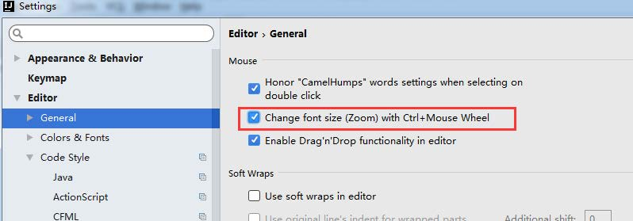
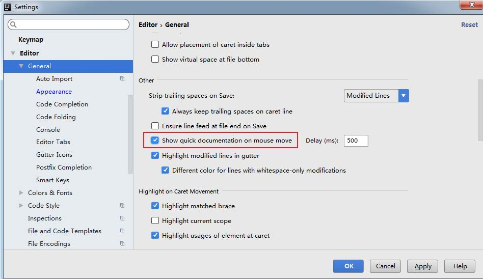
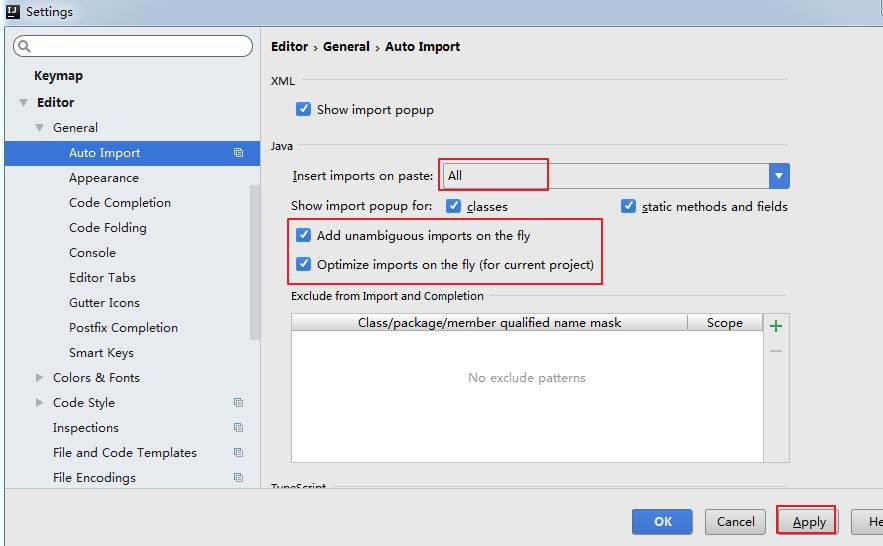
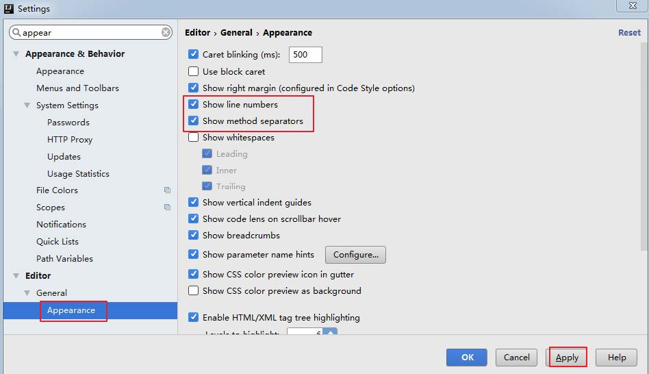
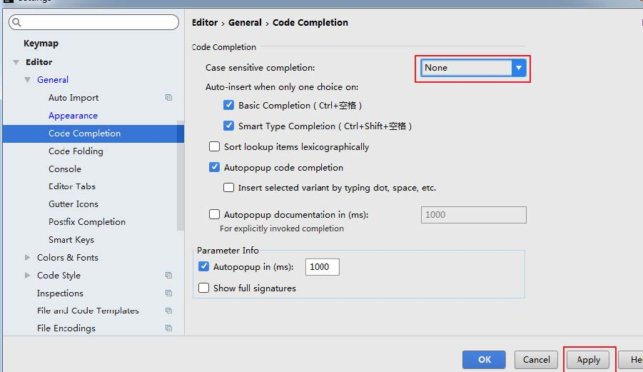
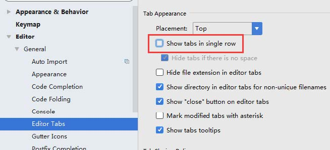
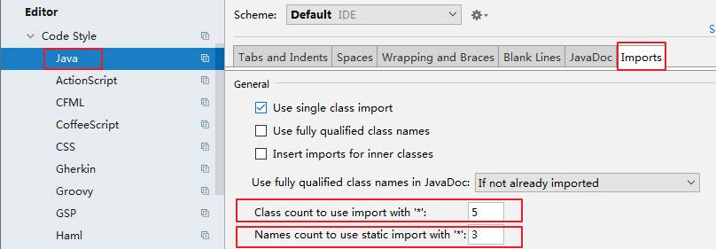
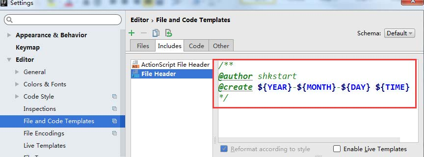

# IDEA 基本环境设置

<!-- TOC depthFrom:2 depthTo:3 -->

- [调取settings面板](#调取settings面板)
- [1.设置鼠标滚轮修改字体大小（可忽略）](#1设置鼠标滚轮修改字体大小可忽略)
- [2.鼠标悬浮提示](#2鼠标悬浮提示)
- [3.设置自动导包](#3设置自动导包)
- [4.设置显示行号和方法间的分隔符](#4设置显示行号和方法间的分隔符)
- [5.忽略大小写提示](#5忽略大小写提示)
- [6.设置取消单行显示tabs的操作](#6设置取消单行显示tabs的操作)
- [7.设置超过指定import个数改为 * ( 可忽略 )](#7设置超过指定import个数改为---可忽略-)
- [8.修改类头的文档注释信息](#8修改类头的文档注释信息)

<!-- /TOC -->

## 调取settings面板

- 调出设置面板的方法：
  - 按住快捷键`Ctrl+Alt+s`
  - 左上角`File` -> `Settings..`

## 1.设置鼠标滚轮修改字体大小（可忽略）



- 我们可以勾选此设置后，增加` Ctrl + 鼠标滚轮` 快捷键来控制代码字体大小显

## 2.鼠标悬浮提示



## 3.设置自动导包



- Add unambiguous imports on the fly：自动导入不明确的结构
- Optimize imports on the fly：自动帮我们优化导入的包

## 4.设置显示行号和方法间的分隔符



- 如上图红圈所示，可以勾选 Show line numbers：显示行数。我建议一般这个要勾选上。
- 如上图红圈所示，可以勾选 Show method separators： 显示方法分隔线。这种线有助于我们区分开方法，所以建议勾选上。

## 5.忽略大小写提示



- IntelliJ IDEA 的代码提示和补充功能有一个特性：区分大小写。如上图标注所示，默认就是 First letter 区分大小写的。
- 区分大小写的情况是这样的：比如我们在 Java 代码文件中输入 stringBuffer， IntelliJ IDEA 默认是不会帮我们提示或是代码补充的，但是如果我们输入StringBuffer 就可以进行代码提示和补充。
- 如果想不区分大小写的话，改为 None 选项即可。

## 6.设置取消单行显示tabs的操作



如上图标注所示，在打开很多文件的时候，IntelliJ  IDEA  默认是把所有打开的文
件名 Tab 单行显示的。但是我个人现在的习惯是使用多行，多行效率比单行高， 因为单行会隐藏超过界面部分 Tab，这样找文件不方便。


## 7.设置超过指定import个数改为 * ( 可忽略 )



## 8.修改类头的文档注释信息



```java
/**
@author congcong
@create ${YEAR}-${MONTH}-${DAY} ${TIME}
*/
```

```txt
常用的预设的变量，这里直接贴出官网给的：
${PACKAGE_NAME} - the name of the target package where the new class or interface will be created.
${PROJECT_NAME} - the name of the current project.
${FILE_NAME} - the name of the PHP file that will be created.
${NAME} - the name of the new file which you specify in the New File dialog box during the file 
creation.
${USER} - the login name of the current user.
${DATE} - the current system date.
${TIME} - the current system time.
${YEAR} - the current year.
${MONTH} - the current month.
${DAY} - the current day of the month.
${HOUR} - the current hour.
${MINUTE} - the current minute.
${PRODUCT_NAME} - the name of the IDE in which the file will be created.
${MONTH_NAME_SHORT} - the first 3 letters of the month name. Example: Jan, Feb, etc.
${MONTH_NAME_FULL} - full name of a month. Example: January, February, etc.
```
