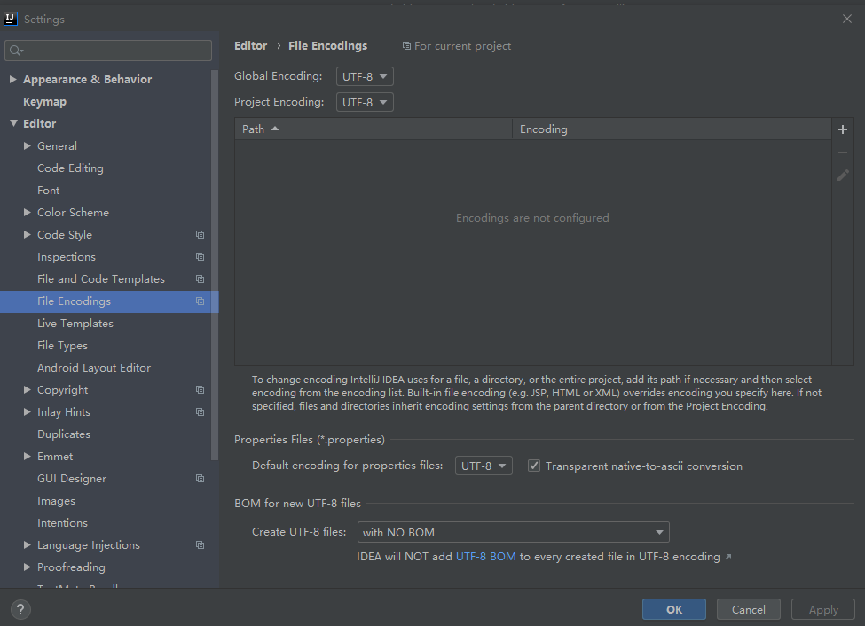
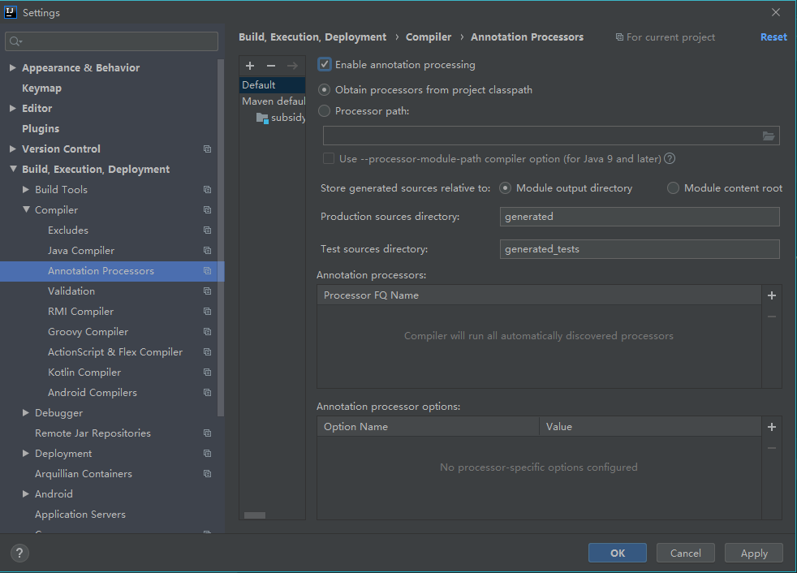
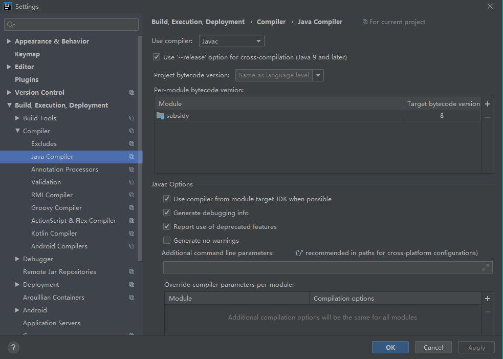
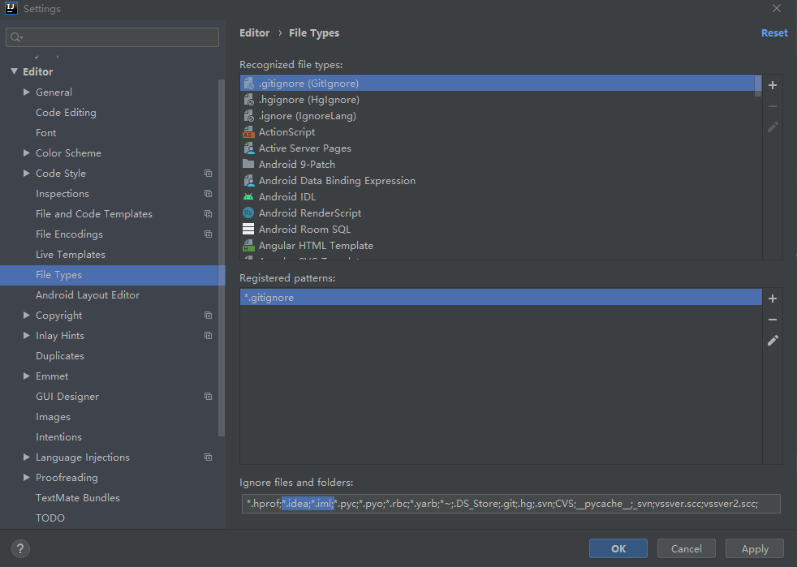
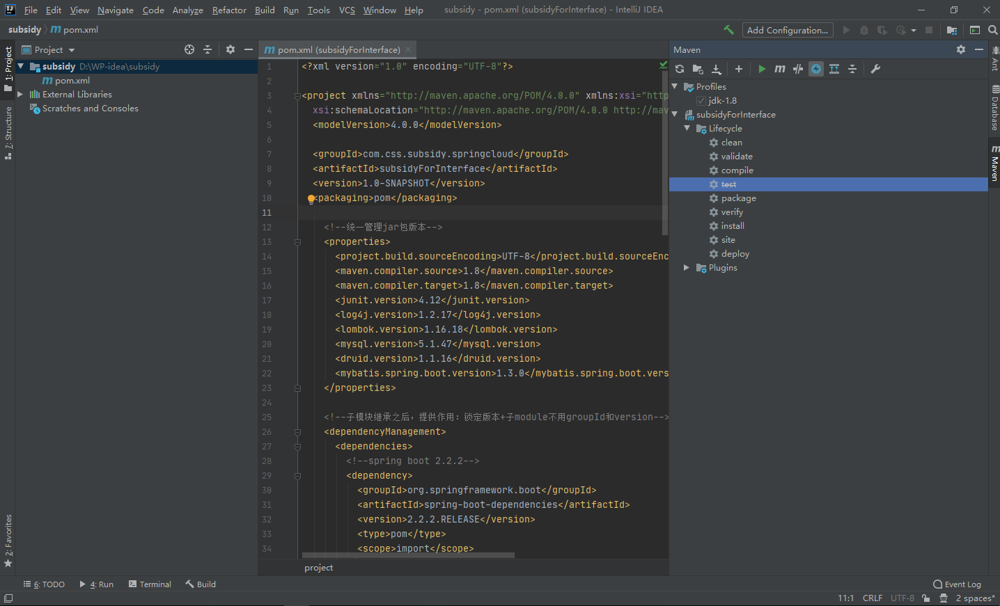
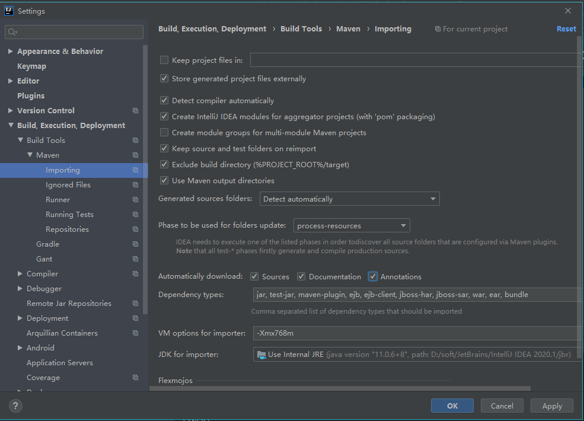
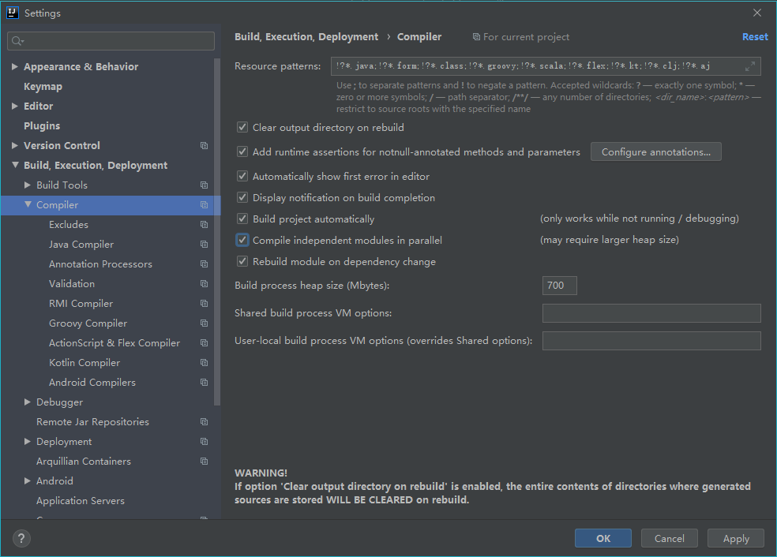
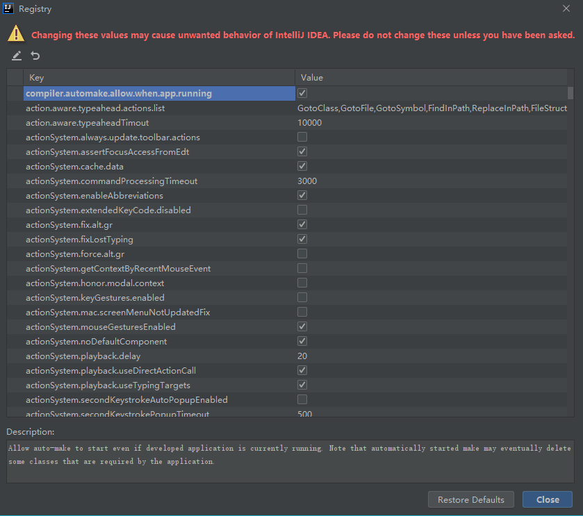

# idea开发环境基本设置

<!-- TOC depthFrom:2 depthTo:3 -->

- [设置字符集](#设置字符集)
- [激活注解](#激活注解)
- [java编译版本](#java编译版本)
- [File type 过滤](#file-type-过滤)
- [maven 跳过单元测试](#maven-跳过单元测试)
- [maven 设置自动下载](#maven-设置自动下载)
- [热部署配置](#热部署配置)
    - [修改pom](#修改pom)
    - [修改配置](#修改配置)
    - [重启idea](#重启idea)

<!-- /TOC -->

## 设置字符集

- file -> settings -> editor -> file Encodings -> utf-8



## 激活注解

- file -> settings -> build,Execution,Deployment -> Compiler -> Annotation Processors -> Default(选中) ->Enable annotation processing



## java编译版本

- file -> settings -> build,Execution,Deployment -> Compiler -> Java Compiler -> Target bytecode version : 8
- 确认编译版本为8



## File type 过滤

- file -> settings -> editor -> File Types -> Ignore files and folders -> add:*.idea;*.iml;



## maven 跳过单元测试

- maven -> Toggle 'Skip Tests' Mode



## maven 设置自动下载

- file -> settings -> Build,Execution,Deployment -> Build Tools -> Maven -> Importing -> Automatically download: sources documentation Annotations



## 热部署配置

### 修改pom

- 修改pom文件
- 引入devtools
- 在父pom中引入plugins操作

```xml
        <dependency>
            <groupId>org.springframework.boot</groupId>
            <artifactId>spring-boot-devtools</artifactId>
            <scope>runtime</scope>
            <optional>true</optional>
        </dependency>

        <build>
            <plugins>
                <plugin>
                <groupId>org.springframework.boot</groupId>
                <artifactId>spring-boot-maven-plugin</artifactId>
                <configuration>
                    <fork>true</fork>
                    <addResources>true</addResources>
                </configuration>
                </plugin>
            </plugins>
        </build>
```

### 修改配置

- file -> settings -> build,Execution,Deployment -> Compiler -> 勾选 A/D/B/C
  - Automatically show first error in editor
  - Display notification on build completion
  - Build project automatically
  - Compile independent modules in parallel



- 使用快捷键--Alt+Shift+Ctrl+/--调出Maintenance选项卡
- 选择Registry，勾选以下两项
  - compiler.automake.allow.app.running
  - actionSystem.assertFocusAcdessFromEdt




### 重启idea

- 重启idea后配置生效