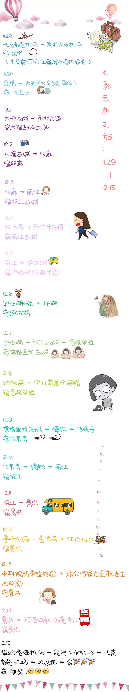

# 云南旅游支线

- 参考路线：北京 -> 昆明 -> 大理 -> 丽江 -> 泸沽湖  -> 香格里拉古城 -> 景洪-> 西双版纳

  > 该攻略以供参考，所有路线都需要根据具体情况而定。

| 站名 | 景点 | 停留时间 | 备注 |
| :--: | :----------: | :--: | ---- |
| 昆明 | [景点-1](#景点-1) |    1     | 转转就好，没什么可玩儿的。         |
| 大理 |      [景点-2](#景点-2)      |    3     | 如果苍山不去的话，转转洱海就好了。 |
|     丽江     | [景点-3](#景点-3) | 4 | 泸沽湖可以去看看。 |
| 香格里拉古城 | [景点-4](#景点-4) | 4 | 这里具体可以变变通，如果想要进藏的话，视情况也可以 |

## 附赠两条别人的路线（必看）

- [路线1](<http://www.mafengwo.cn/gonglve/ziyouxing/258760.html>)：<http://www.mafengwo.cn/gonglve/ziyouxing/258760.html>
- [路线2](<http://www.mafengwo.cn/gonglve/ziyouxing/49856.html>)：<http://www.mafengwo.cn/gonglve/ziyouxing/49856.html>

> 自由行的路线，多多看没有坏处，而且一定要看。

## 第一站：昆明

> 从北京飞昆明

- 住宿与当天安排：根据下飞机的时间，首先考虑住宿的地方，可以提前订好住宿的地方，如果提前顶酒店，最好带有接机服务的，安顿好后可以考虑去最近的景点转转，前三个比较近，最后一个比较远，也可以走上街头看看当地人是怎么生活的。

> 云南中午11点到下午四点会特别热，而且紫外线特别强两，可以考虑在旅馆先休息一下，然后下午四点以后再出去。

- 准备：晚上的时候，要考虑后一天的安排，如果要在昆明停留一天的话，需要旅馆续租，如果不停留，准备第二天的出行方式，比如去大理的话，要订火车票，不贵，100+就完全可以搞定。（离开旅馆的时候记得检查行李是否整理完全，不要遗漏东西。）

### 景点-1

> 昆明附近还有一些其他的地方，但是大同小异，所以可以看情况去看看

- **圆通禅寺**
    圆通禅寺位于云南省昆明市，是昆明市最大的佛教活动场所。
- **翠湖**
    翠湖是位于云南昆明市区中心地带偏西北的一个湖泊，现在是一个公园。北部为圆通山，东为五华山。占地面积352亩。因其八面水翠，四季竹翠，春夏柳翠，故称“翠湖”。
- **东西寺塔**
    东西寺塔是中国云南省会昆明市的两座古塔，分别位于东寺街和书林街，南诏国弄栋节度使王嵯巅主持修建，大匠尉迟恭韬造，是昆明现存最早的建筑物之一。
- **石林风景名胜区**
    石林风景名胜区，常称路南石林或云南石林，位于中国云南省石林彝族自治县，1982年11月8日经中华人民共和国国务院批准为首批国家重点风景名胜区，其时法定名称为“路南石林风景名胜区”。

## 第二站：大理

> 昆明坐火车到大理

> 假设在大理停留三天

> 大理的主要景点：洱海，苍山，喜洲古镇，双廊古镇
>
> 大理市中心到大理古城：在大理火车站出站口广场坐火车站—-崇圣寺三塔的专线公交车，在红龙井城门下车（此站在一塔路口站之后，请特别告诉司机在红龙井下车）

- 交通方式：最节约的方式是从火车站出来坐公交车到大理古城，三块，然后还可以选择其他的交通方式。

> 我之前去的住宿地址：在大理火车站出站口广场坐火车站—-崇圣寺三塔的专线公交车，在红龙井城门下车（此站在一塔路口站之后，请特别告诉司机在红龙井下车），下车后穿过公路在右前方七七客栈路口往上坡方向步行100米即可见 **云梦湾招牌**。 客栈老板电话:133 0872 0874

### 洱海

> 达到大理古城之后，找住宿的地方，如果时间充裕，然后可以考虑环洱海

- 租车：三种租车方式
  - 电动车（推荐）：80元/天 ，一般可以跑200公里的80元/天 （手机导航，记得带上充电宝）
  - 汽车：200元/天 ，价格不等，但是在200元/天的情况比较多，如果不想被晒的话可以考虑，车上还可以一边充电，一边导航
  - 旅拍：500元/天，主要是小年轻去拍照片的，如果有没有需求可以不考虑。
  
### 苍山

>主要是山景，还有一些小的景点，如果是玉带路那条到的话可以不考虑，没有什么可玩儿性。
>
>可以和客栈老板交流一下，一些小庙啊之类的，还是可以去看看的。

- 寂照庵
- 天龙八部影视基地

### 景点-2

> 洱海这条线，可以用一天走完，如果是走马观花的话，

- **洱海**
   *湖泊、湿地、浪漫关系、马术和温泉*
   洱海，古称昆明池、洱河、叶榆泽等。因其状似人耳，故名洱海，位于云南省大理白族自治州大理市。一般湖水面积约246平方千米，蓄水量约29.5亿立方米，呈狭长形，北起洱源县南端，南止大理市下关，南北长40公里，是仅次于滇池的云南第二大湖，中国淡水湖中居第7位。洱海形成于冰河时代末期，其成因主要是沉降侵蚀，属高原构造断陷湖泊，海拔1972米。洱海具有供水、农灌、发电、调节气候、渔业、航运

- **苍山**
   *山、远足和湖泊*
   苍山又名点苍山，位于云南省大理市，东临洱海，长约50千米，宽约20千米，位于滇中高原和横断山区交界处，是云岭山脉的一部分，因苍山山顶终年积雪不化，故名点苍，南诏时代

##  第三站：丽江

> 从大理到丽江可以做公交过去。

> 从这里开始就是网上的推荐了，所以需要随机应变了。

- 主要景点：丽江古城，玉龙雪山，泸沽湖

### 泸沽湖

- 主要是日出和环湖，需要在那边稍微住一晚，如果之后还需要返回丽江古城

### 景点-3

- **虎跳峡**
   地标性幽深峡谷，可欣赏河流风光
   
   号称世界上最深峡谷之一的天然大峡谷，可俯瞰河流风光，另有小径。
   
- **玉龙雪山**
   冰川、湖泊、牦牛、山、滑雪场和登山运动
   
   玉龙雪山为云南省丽江市境内雪山群，地处东经100°4′2″～100°16′30″、北纬27°3′2″～27°18′57″之间，在丽江北面约15千米处，全长75千米，是北半球最近赤道终年积雪的山脉，隔江西与中甸雪山、东与绵绵山相并列，北自三江口，向南延伸到北纬27°，如扇面向古城展开。全山的13座山峰由南向北纵向排列，主峰扇子陡最高处海拔5596米，终年积雪，发育有亚欧大陆距离赤道
   
-  **丽江古城**
   历史悠久且独特的都市村庄
   
   拥有 800 年历史的古城区，有鹅卵石街道、溪流、小桥和传统的纳西族房屋。

- **拉市海**

  拉市海是云南丽江拉市海高原湿地省级自然保护区的核心部分，位于中国云南省丽江市西面8公里处的拉市坝中部，玉龙雪山东南坡。“拉市”为古纳西语译名，“拉”为荒坝，“市”为新，意为新的荒坝。拉市海是著名的候鸟聚集地，每年冬天约有两万多只候鸟会在此处过冬。
  
- **泸沽湖**

   湖泊

   泸沽湖，亦称永宁海、左所海、勒得海、落水海子，是一个高原淡水湖，位于中华人民共和国云南省北部、四川省西南部，即四川省凉山自治州盐源县与云南省丽江市宁蒗彝族自治县之间，横跨川、滇两省。湖泊东南面长满水草的大片湿地称为草海，广阔的水域称为亮海，湖面海拔2690米，面积48.45平方千米。泸沽湖是川、滇两省共管的湖泊，湖水透明洁净，属中国Ⅰ类水质，但环境问题也相当严峻。

## 第四站：香格里拉

> 香格里拉的各个景点之间距离比较远，可以不是特别赶，可以根据当时情况，去几个就可以了。

### 景点-4

- **虎跳峡**
  地标性幽深峡谷，可欣赏河流风光
  号称世界上最深峡谷之一的天然大峡谷，可俯瞰河流风光，另有小径。

- **普达措国家公园**
 湖泊和自然保护区
 普达措国家公园，位于滇西北"三江并流"世界自然遗产中心地带，由国际重要湿地碧塔海自然保护区和"三江并流"世界自然遗产哈巴片区之属都湖景区两部分构成，以碧塔海、属都湖和弥里塘亚高山牧场为主要组成部分，也是香格里拉旅游的主要景点之一。海拔在3500米至4159米之间，属省级自然保护区，是"三江并流"风景名胜区的重要组成部分。

- **哈巴雪山**
   哈巴雪山是位于中国云南省香格里拉市境内的一座山峰，与玉龙雪山隔江而望。“哈巴”为纳西语，意思是“金子之花朵”。主峰海拔5396米，比山下流过的金沙江高出3500多米。巨大的海拔高差，形成了明显的高山垂直性气候

- **碧塔海**

   湖泊

   碧塔海是中国云南省迪庆藏族自治州香格里拉市的一个高原湖泊，位于县城以东25千米。该湖在藏语中称为“碧塔德错”，意为牛毛毯魔海。碧塔海湖面海拔3538米，是云南省海拔最高的湖泊。碧塔海湖水未受到污染，清澈碧蓝，能见度极高，倒映周围雪山树影，风景优美。

- **纳帕海**

  纳帕海是中国云南省迪庆藏族自治州香格里拉市的一个季节性高原湖泊，位于县城西北方8千米，海拔3266米，周围三面环山，山峰海拔3800—4449米。夏季时积雪融化，形成湖泊，秋冬季节湖泊退化形成依拉草原。冬季，黑颈鹤、斑头雁、野鸭等来此越冬。目前这里是一个自然保护区

## 别人的路线

