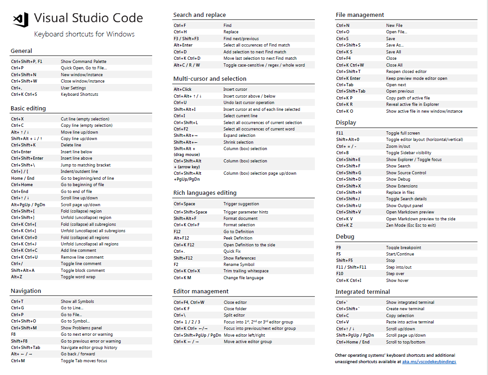

# 2018年10月25日

## 补办北京银行卡

- 把新的卡号信息提交给 王俊雅
  - 卡号
  - 开户行
  - 开户人名称

## 互联网开始剩余任务

### 助学建表

- 建表
- 实体类
- 服务层 service
- 添加字典表
- 修改页面js

### 助学子女

- 建表（不与助学使用同一张表建设新表）
- 实体类
- 服务层 service
- 添加字典表（与助学使用同一组字典）
- 修改页面js（改动较大）

### 返回信息的修改与表达

- 职业培训
- 创业补贴
- 一次性缴费补贴
- 创业表现补贴
- 助学补贴
- 助学子女补贴

### 职业培训补贴

- 添加文件上传按钮

### 实现文件上传

- js样式
- 保存功能

### 打印页面信息

- css样式

## vscode快捷键

## md表格 尝试添加表头

表头|||
--|--|--|
表头一|表头二|表头三
1|2|3
