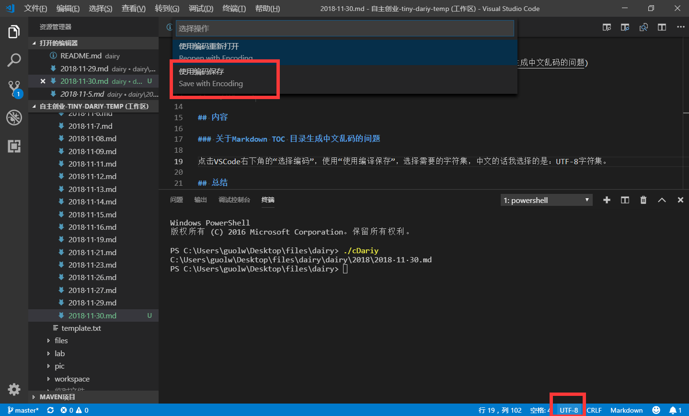
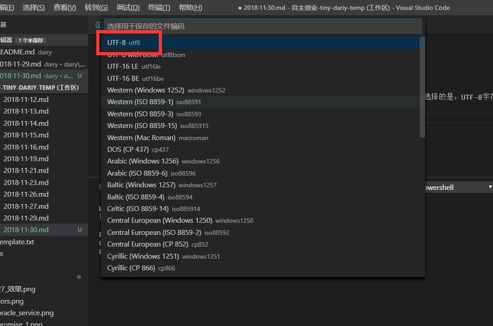

# 2018·11·30

## 目录

<!-- TOC -->

- [2018·11·30](#20181130)
    - [目录](#%E7%9B%AE%E5%BD%95)
    - [账目](#%E8%B4%A6%E7%9B%AE)
    - [内容](#%E5%86%85%E5%AE%B9)
        - [Markdown TOC 目录生成中文乱码的问题](#markdown-toc-%E7%9B%AE%E5%BD%95%E7%94%9F%E6%88%90%E4%B8%AD%E6%96%87%E4%B9%B1%E7%A0%81%E7%9A%84%E9%97%AE%E9%A2%98)
        - [河南数据导出](#%E6%B2%B3%E5%8D%97%E6%95%B0%E6%8D%AE%E5%AF%BC%E5%87%BA)
        - [图片上传功能](#%E5%9B%BE%E7%89%87%E4%B8%8A%E4%BC%A0%E5%8A%9F%E8%83%BD)
    - [总结](#%E6%80%BB%E7%BB%93)
        - [九龙冰室](#%E4%B9%9D%E9%BE%99%E5%86%B0%E5%AE%A4)
        - [old navy](#old-navy)

<!-- /TOC -->

## 账目

|名称|价格|备注|
|--|--|--|
早饭|7.5|馄饨，半屉包子
午饭|19|异口良食，鸭蛋
晚餐|168|九龙冰室--pass
牛仔褂|159.6|old navy
裙子|45|old navy

## 内容

### Markdown TOC 目录生成中文乱码的问题

点击VSCode右下角的“选择编码”，使用“使用编译保存”，选择需要的字符集，中文的话我选择的是：UTF-8字符集。



### 河南数据导出

```ps1
$tableName = "z_hb_r0_r41_trans"
$areacode = "4112"
$sql = ""
foreach ($a in $areacode)
{
    $sql += "--$a
    select * from {table_name} t where substr(t.area_code,0,4) = '$a'"  -replace "{tableName}",$tableName 
}
$fileName = ".\2018.11.30.sql"
$sql > $fileName
Notepad $fileName
```

### 图片上传功能

git地址:
> https://github.com/guocongcongcong/bootstrap-fileinput


## 总结

### 九龙冰室

>只能给个一般的评价。

- 菜品：三星
    - 一口西多士：吃起来一般，没觉得哪儿好吃，不知道哪儿好吃，可能因为我觉得他应该会是热的，但是确实凉的，心理落差较大吧。
    - 经典套餐：鸡蛋很讲究，但是不是喜欢的类型，面包外面看起来是酥的，但是吃起来有点儿肉。不太喜欢。
        - 奶茶：没有加糖，自己加糖，这个我很喜欢
    - 炒牛河：水平还不错，但是总体感觉就是沙县的炒河粉。
    - 咖喱鱼蛋：咖喱味很浓，如果你喜欢这一口的话，应该会喜欢。但是我更喜欢吃鱼蛋不带那种咖喱味的那种。
    - 小料：盐，糖，胡椒，辣椒酱（很喜欢他家辣椒酱）
    - 总体：不是特别对胃口。
- 服务：五星
    - 服务员给我的感觉比较好，周五晚上八点多到的，相对人不是特别多，和隔壁呷哺比。服务员很热情，随叫随到。
- 环境:四星
    - 装修还不错，很有特色，和楼上的港岛比的话更具特色。
    - 卫生情况较好，桌面很干净，地面也没有东西，服务员身上就带着清洁用具，看起来很好。
  
### old navy

他家衣服，总体来讲，经济实惠。但是需要合适自己的。