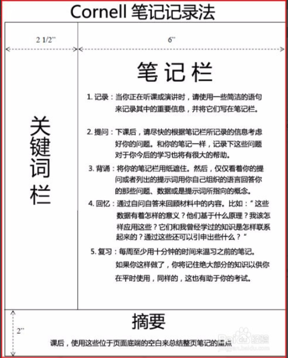
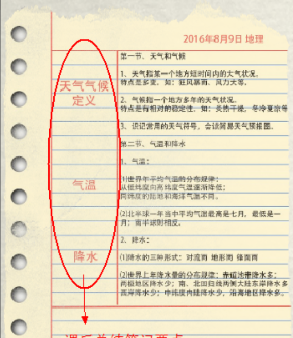
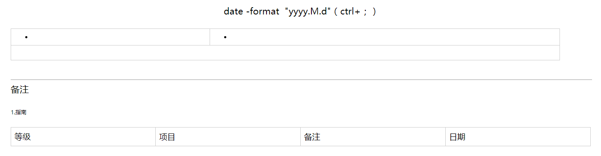

# 2018/10/8

## 克苏鲁神话整理

[克苏鲁神话书名对照表](./files/克苏鲁神话书名对照表.xlsx)

## vue示例

[Vue示例](./vue示例)

## 10月份的工作指南

等级|项目|备注|日期
--|--|--|--
1|河南项目的错误修改|--|需要修改的时候
2|河南自动程序的编写|--|本月21日之后
3|甘肃数据可能的修改|--|随时
3|河南项目的数据查询|--|随时
4|两个新系统|互联网|本月21日之前

## 10月份的生活指南

等级|项目|备注|日期
--|--|--|--
1|对接微信小程序|--|整月
2|编写vue项目|--|整月
3|画画|素描|整月
3|减肥|一周运动四次|每次不少于40分钟
4|读书|批判性思维工具|每天阅读40分钟
4|整理账目|修改接下来的整体方针|14日晚八点之前

## 关于规则

>使用康奈尔笔记法记录主要内容
 "康奈尔笔记"
>关于提要的主要使用
 "提要的使用"
>添加备注信息已做备用

>每月月初填写指南，包括生活指南和工作指南
>
>备注：
>[格式地址](https://app.yinxiang.com/shard/s35/nl/7805108/b7dd22fa-23c0-4152-a6e8-8d30ba8d520d)

### 河南查数

```sql
select t.name 姓名,
       (select  t1.dict_name from zcl_cdpf_dictionary_down t1 where  t1.dict_code = 'SEX' and  t1.dict_value = ( t.sex -1 )) 性别,
       (select  t1.dict_name from zcl_cdpf_dictionary_down t1 where  t1.dict_code = 'NATION' and  t1.dict_value =  t.nation) 民族,
       t.brith_time 出生日期,
       t.idcard 身份证号,
       t.disabled_number 残疾证号,
       (select  t1.dict_name from zcl_cdpf_dictionary_down t1 where  t1.dict_code = 'DISABLED_TYPE' and  t1.dict_value = t.disabled_type) 类别,
       (select  t1.dict_name from zcl_cdpf_dictionary_down t1 where  t1.dict_code = 'DISABLED_LEVEL' and  t1.dict_value =t.disabled_level) 等级,
       (select  t1.dept_name from zcl_horizon_dept t1 where   t1.id = (substr( t.area_code, 0, 4) || '00000000')) 所属市,
       (select  t1.dept_name from zcl_horizon_dept t1 where   t1.id = (substr( t.area_code, 0, 6) || '000000')) 所属县,
       t.domicile_area 家庭地址, 
       t.first_time 发证日期,
       t.guard_name 监护人,
       t.con_tel 联系电话,
       t.con_phone 联系电话
  from zcl_canlian_renzheng t
 where t.STATE = 1;
```