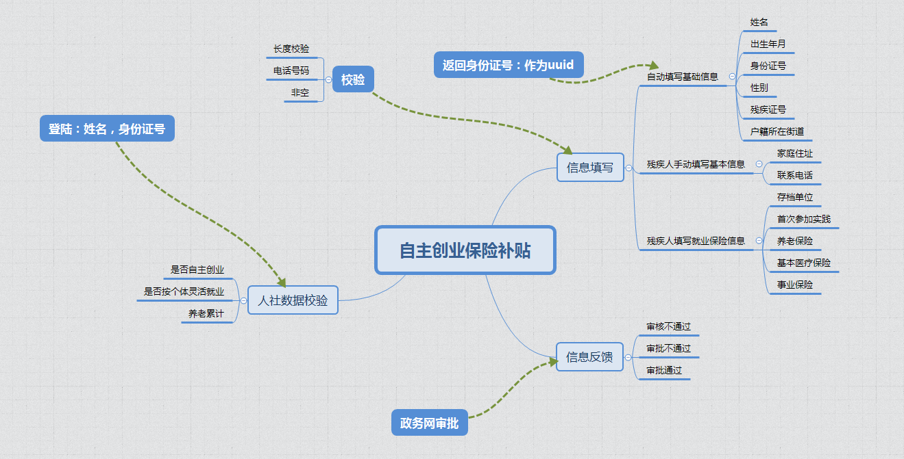

# 2018/10/9

## 自主创业

### 前端页面的修改

### 简历字典

- 性别
  - 1：男
  - 2：女
- 申请登记次数
  - 1
  - 2
  - 3
- 证照类型
  - 个体工商户
  - 各类企业
  - 农民专业合作社
  - 社会团体
  - 民办非企业单位

## 自主创业保险补贴

### 整体逻辑

#### 信息来源与存贮

- 人社数据库
  >外部引入
  - 身份证号
  - 标识：自主创业
  - 标识：个体灵活就业
  - 标识：养老累计
  - 时间：完成缴费时间
- 残疾人信息数据库
  >外部引入
- 自主创业保险主表 self_employment_insurance
  - 唯一标识:uuid
  - 姓名：name
  - 身份证号：id_card
  - 出生日期:birthday
  - 性别:sex
  - 残疾证号:disabled_num
  - 户籍所在街道代码:area_code
  - 家庭住址:address
  - 联系电话:con_phone
  - 存档单位:archive_unit
  - 首次参加实践:first_time_participation
  - 标识：养老保险:pension_insurance
  - 标识：基本医疗:basic_medical_insurance
  - 标识：事业保险:business_insurance
  - 标识: 同步:synchronous
  - 标识：申请状态:application_status
- 信息反馈表
  - 反馈类型:feedback_type
  - 反馈状态:feedback_status
  - 反馈信息:feedback_info
  - 备注:remark
- 自主创业补贴字典表 ：t_dict
  >外部引入--与残疾人信息数据库来源一直
  - 唯一标识:uuid
  - 字典类型:dict_type
  - 字典值:dict_value
  - 字典名称:dict_name
  - 备注:remark
- 区划编码字典表
  >外部引入--与基本信息来源一致

##### 信息反馈表

- 人社校验
  - 未通过
- 申请
  - 未申请
  - 已申请
- 承诺
  - 真实信息承诺
- 审批
  - 审核不通过
  - 审批不通过
  - 审批通过

##### 校验

- 非空
- 电话号码
- 字节长度
- 数字校验

### 建设顺序

- 前端页面
- 字段导入
- 校验添加
- token添加
- 人社校验
- 反馈信息

### 本地建库

subsidy:subsidy